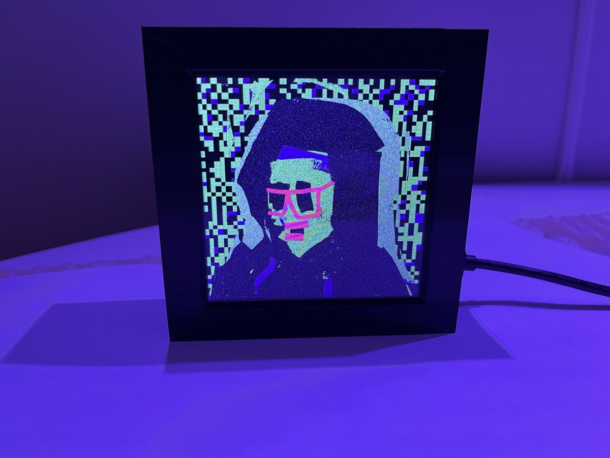
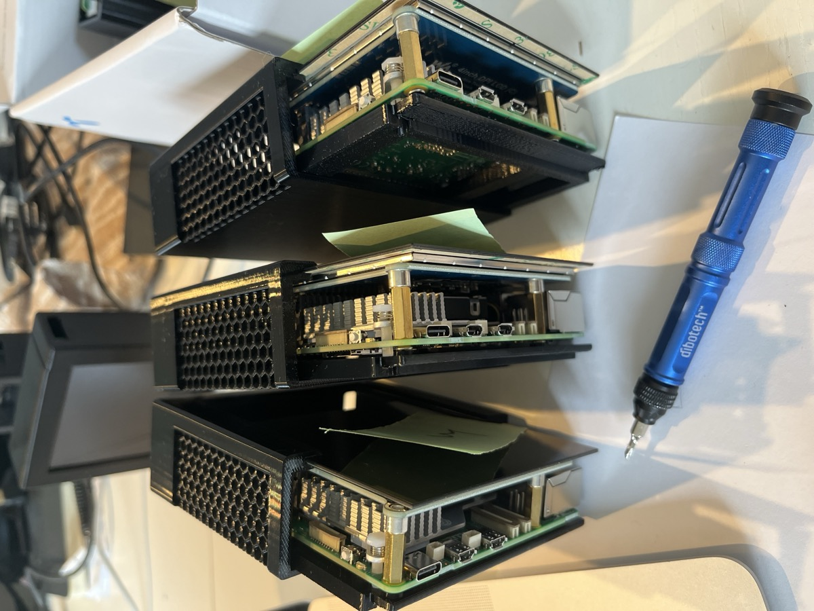

# Vernis

A digital art display system built on Raspberry Pi. Vernis turns a Pi into a dedicated NFT and digital art frame with a touch-screen interface, IPFS integration, and Philips Hue ambient lighting.

<p align="center">
  
</p>

## Features

- **Gallery Mode** — Fullscreen art display with crossfade transitions, shuffle, and configurable intervals
- **IPFS Integration** — Download and pin NFT artwork directly from IPFS; verify content integrity via CID
- **CSV Collection Import** — Load entire collections from CSV files with CID or URL references
- **Philips Hue Sync** — Real-time ambient lighting that matches the displayed artwork using the Hue Entertainment API (DTLS streaming at 25 Hz)
- **Touch UI** — Optimized for small displays (4" Waveshare DPI LCD) with 44px+ touch targets
- **Kiosk Mode** — Auto-starts Chromium in fullscreen on boot; gallery if art exists, home screen if not
- **Lab** — Built-in Art Blocks Gazer renderer, PixelChain ASCII viewer, CryptoPunks, and Autoglyphs
- **Remote Rendering** — Stream WebGL generators from a Docker container to the Pi via RTSP
- **Display Management** — Internal DPI, external HDMI, or mirror mode with per-output rotation
- **Thermal Management** — CPU profiles, fan control, thermal monitoring with configurable governors
- **WiFi Provisioning** — Setup AP mode for headless configuration, plus Bluetooth PAN fallback
- **Backup & Restore** — Full device backup with progress tracking
- **OTA Updates** — GitHub-based update system with rollback support

## Hardware

- Raspberry Pi 5 (8 GB recommended, works with 4 GB+)
- Waveshare 4" DPI LCD (C) — 720x720 IPS, square format
- 3D-printed or custom picture frame enclosure
- Optional: Philips Hue lights for ambient sync

<p align="center">
  
</p>

## Architecture

```
Browser (Chromium kiosk)
    |
    v
Caddy (HTTPS reverse proxy) ──> /var/www/vernis/   (static HTML/CSS/JS)
    |
    v
Flask API (/opt/vernis/app.py)  ──> IPFS daemon
    |                               Hue Entertainment daemon
    v                               Thermal monitor
/opt/vernis/nfts/               Screen saver daemon
/opt/vernis/csv-library/
/opt/vernis/scripts/
```

**Web UI** — Single-page HTML files served by Caddy from `/var/www/vernis/`

**Backend** — Flask API at `/opt/vernis/app.py` handling collections, downloads, IPFS, display control, Hue, thermals, WiFi, and system management

**Scripts** — Shell and Python scripts in `/opt/vernis/scripts/` for installation, kiosk launch, display setup, and hardware configuration

## Installation

### Fresh Install

1. Flash Raspberry Pi OS (64-bit, Bookworm+) to an SD card
2. Boot the Pi and connect via SSH
3. Clone this repo and run the installer:

```bash
git clone https://github.com/AfroV/vernis.git
cd vernis
bash scripts/install-vernis.sh
```

The install script handles everything: Caddy, Flask, IPFS, display overlays, kiosk autostart, systemd services, and firewall.

### Waveshare 4" DPI Display

The installer auto-configures the Waveshare 4" DPI LCD (C). For manual setup:

```bash
bash scripts/setup-waveshare-4dpi.sh
```

### Low-RAM Devices

For Pis with less than 2 GB RAM:

```bash
sudo bash scripts/setup-swap.sh
```

## Usage

After installation, the Pi boots directly into the Vernis UI:

- **No art installed** — Shows the home screen with setup instructions
- **Art installed** — Starts the fullscreen gallery

Access the web UI from any device on the same network at `https://<pi-ip>/`

### Adding Art

1. Navigate to **Library** and add a collection via CSV upload
2. Or go to **Add** and paste IPFS CIDs directly
3. Art downloads from IPFS and is optionally pinned for persistence

### Philips Hue Setup

1. Go to **Settings > Ambient Lights**
2. Press the link button on your Hue Bridge
3. Select lights for ambient sync
4. Toggle the sun icon in the gallery to start color sync

## Project Structure

```
vernis/
├── backend/
│   ├── app.py                    # Flask API (all endpoints)
│   ├── screen_saver_daemon.py    # Screen saver service
│   ├── thermal_monitor.py        # Thermal monitoring daemon
│   └── scripts/
│       ├── nft_downloader_advanced.py  # IPFS/HTTP art downloader
│       ├── enrich_nft_csv.py           # CSV enrichment via Reservoir API
│       └── known_origin_scraper.py     # Known Origin IPFS scraper
├── scripts/
│   ├── install-vernis.sh         # Full installation script
│   ├── kiosk-launcher.sh         # Chromium kiosk startup
│   ├── display-output.sh         # Display mode management
│   ├── hue-stream.c              # DTLS 1.2 PSK Hue Entertainment client
│   ├── hue-entertainment-daemon.py  # Hue streaming daemon
│   ├── setup-waveshare-4dpi.sh   # Waveshare DPI display setup
│   └── ...                       # WiFi, BT, thermal, update scripts
├── *.html                        # Web UI pages
├── vernis-themes.css             # Theme system (XCOPY, default)
├── vernis-keyboard.js            # On-screen keyboard
├── vernis-notifications.js       # Toast notification system
└── docs/
    └── images/                   # Product photos
```

## Display Notes

- The Waveshare 4" DPI LCD uses **RGB666** (18-bit color) — slight color banding on gradients is a hardware limitation
- `dpi-backlight.service` must be **disabled** — it corrupts GPIO 18 (DPI data pin). The LCD backlight is always-on via the ribbon cable
- `over_voltage` must be exactly **4** for DPI displays — other values cause scan lines or color shifts
- Do not overclock DPI-connected Pis — changing `gpu_freq`/`arm_freq` shifts pixel clock dividers

## License

[Apache License 2.0](LICENSE)

## Credits

Created by [AfroViking](https://x.com/NFTart)
